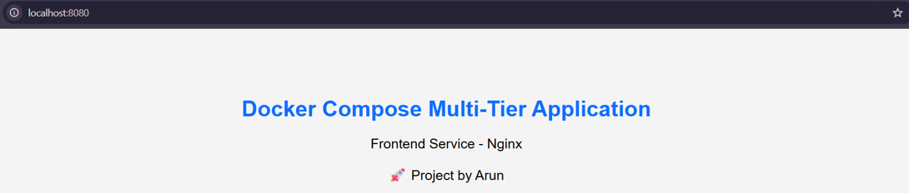
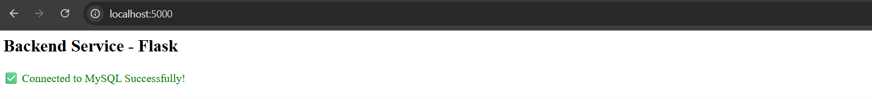
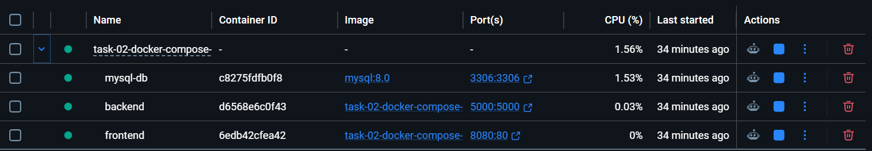
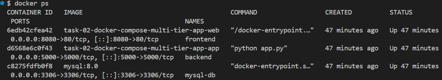
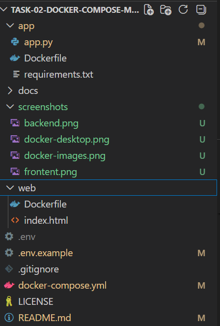

# Docker Compose Multi-Tier Application

A simple **3-tier microservices application** built using **Docker Compose**. This project demonstrates how to deploy and manage multiple containers including a **Frontend (Nginx)**, **Backend (Flask)**, and **Database (MySQL)** using Docker Compose.

---

## Project Overview

This project consists of three services:

- **Frontend:** Nginx
- **Backend:** Python Flask
- **Database:** MySQL 8.0 (Official Image)

The backend communicates with the MySQL database, while Docker Compose manages networking, environment variables, and persistent storage.

---

# Architecture

```
                    Browser
                        │
                        ▼
               +----------------+
               |   Nginx (Web)  |
               |    Port 8080   |
               +----------------+
                        │
                        ▼
               +----------------+
               | Flask Backend  |
               |    Port 5000   |
               +----------------+
                        │
                        ▼
               +----------------+
               | MySQL Database |
               |    Port 3306   |
               +----------------+

          Docker Compose Network
          Persistent Volume (mysql-data)
```

---

# Project Structure

```
task-02-docker-compose-multi-tier-app/
│
├── app/
│   ├── Dockerfile
│   ├── app.py
│   └── requirements.txt
│
├── web/
│   ├── Dockerfile
│   └── index.html
│
├── screenshots/
│   ├── frontend.png
│   ├── backend.png
│   ├── docker-desktop.png
│   ├── docker-ps.png
│   └── project-structure.png
│
├── .env.example
├── .gitignore
├── docker-compose.yml
├── LICENSE
└── README.md
```

---

# Technologies Used

- Docker
- Docker Compose
- Nginx
- Python Flask
- MySQL 8.0
- Git
- GitHub

---

# Features

- Multi-container application
- Docker Compose orchestration
- Official MySQL Image
- Official Nginx Image
- Custom Flask Docker Image
- Environment Variables
- Docker Networking
- Persistent Storage using Docker Volumes
- Backend successfully connects to MySQL

---

# Environment Variables

Create a `.env` file in the project root.

```env
MYSQL_ROOT_PASSWORD=root123
MYSQL_DATABASE=task02db
MYSQL_USER=arun
MYSQL_PASSWORD=arun123

DB_HOST=db
DB_PORT=3306
```

A sample template is available in:

```
.env.example
```

---

# Docker Compose

Start the application:

```bash
docker compose up --build
```

Stop the application:

```bash
docker compose down
```

Remove containers, network and volume:

```bash
docker compose down -v
```

View running containers:

```bash
docker ps
```

---

# Application URLs

Frontend

```
http://localhost:8080
```

Backend

```
http://localhost:5000
```

---

# Verification

Verify running containers:

```bash
docker ps
```

Verify Docker images:

```bash
docker images
```

Verify Docker volumes:

```bash
docker volume ls
```

Verify Docker networks:

```bash
docker network ls
```

---

# Project Screenshots

## Frontend



---

## Backend (Connected to MySQL)



---

## Docker Desktop



---

## Running Containers



---

## Project Structure



---

# Docker Compose Services

| Service | Image | Port |
|----------|-------|------|
| Web | Custom Nginx Image | 8080 |
| Backend | Custom Flask Image | 5000 |
| Database | mysql:8.0 | 3306 |

---

# Docker Concepts Demonstrated

- Docker Images
- Docker Containers
- Dockerfile
- Docker Compose
- Environment Variables
- Docker Volumes
- Docker Networks
- Port Mapping
- Multi-container Architecture

---


# Author

**Arun Padmanabhan**


---

# License

This project is licensed under the MIT License.